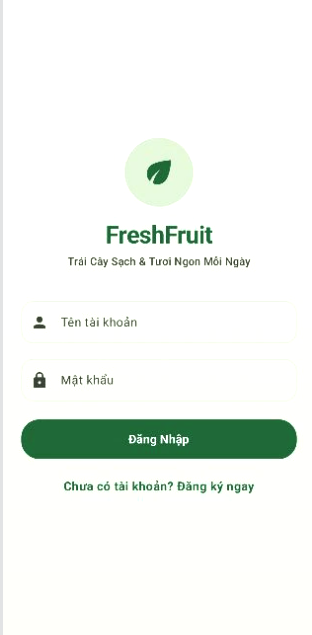
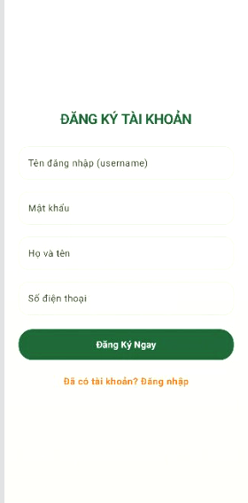
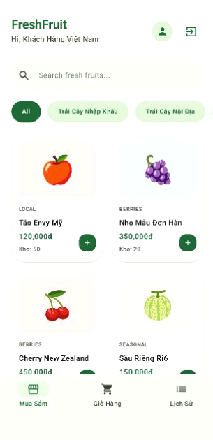
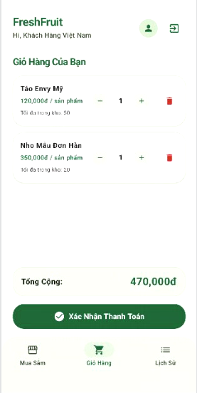
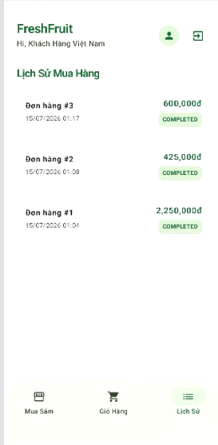
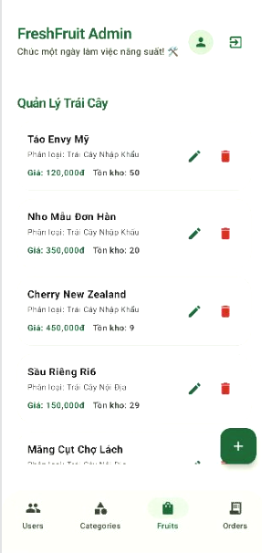
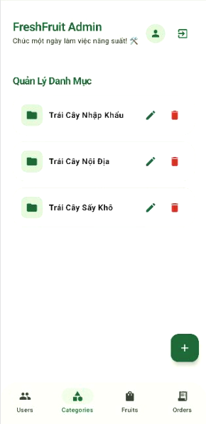
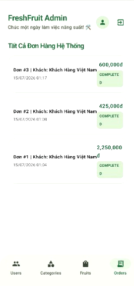
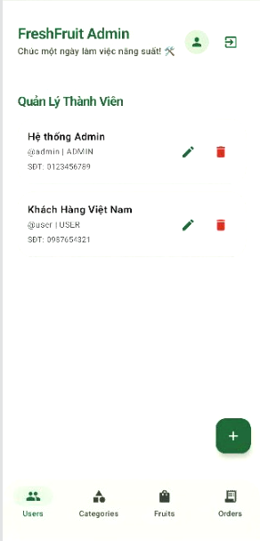

# FreshFruit - Cửa hàng trái cây trực tuyến 🍏🍊

**FreshFruit** là một ứng dụng di động Android thương mại điện tử, được phát triển bằng ngôn ngữ **Kotlin** và giao diện hiện đại **Jetpack Compose**. Ứng dụng cung cấp giải pháp mua sắm trái cây tươi trực tuyến một cách nhanh chóng, tiện lợi cho cả khách hàng và quản trị viên.

## 🌟 Tính năng chính

### 🧑‍💼 Dành cho Khách hàng (Users)
- **Đăng nhập & Đăng ký**: Hỗ trợ tạo tài khoản và xác thực người dùng an toàn.
- **Duyệt sản phẩm**: Xem danh sách các loại trái cây theo danh mục, hiển thị thông tin chi tiết và tình trạng tồn kho.
- **Giỏ hàng thông minh**: Thêm, sửa, xóa sản phẩm trong giỏ hàng. Cảnh báo thông minh khi hết hàng hoặc nhập số lượng quá mức tồn kho.
- **Thanh toán**: Mô phỏng quá trình đặt hàng và thanh toán nhanh chóng.
- **Lịch sử mua hàng**: Theo dõi các đơn hàng đã mua và trạng thái của chúng.

### 👑 Dành cho Quản trị viên (Admin)
- **Quản lý Sản phẩm & Danh mục**: Thêm mới, chỉnh sửa, xóa trái cây và các danh mục sản phẩm (CRUD).
- **Quản lý Đơn hàng**: Theo dõi và quản lý tất cả các đơn hàng từ khách hàng.
- **Quản lý Người dùng**: Xem và quản lý thông tin người dùng trong hệ thống.

## 📸 Giao diện ứng dụng

Dưới đây là một số hình ảnh giao diện chính của ứng dụng:

| Đăng nhập | Đăng ký |
| :---: | :---: |
|  |  |

| Trang chủ mua sắm | Giỏ hàng | Lịch sử mua hàng |
| :---: | :---: | :---: |
|  |  |  |

| Admin - Quản lý Trái Cây | Admin - Quản lý Danh Mục | Admin - Quản lý Đơn Hàng | Admin - Quản lý Thành viên |
| :---: | :---: | :---: | :---: |
|  |  |  |  |

## 🛠 Công nghệ sử dụng
- **Ngôn ngữ**: Kotlin
- **UI Framework**: Jetpack Compose (Material Design 3)
- **Kiến trúc**: MVVM (Model-View-ViewModel) với Coroutines & Flow
- **Cơ sở dữ liệu cục bộ**: Room Database (SQLite) với Kotlin Symbol Processing (KSP).
- **Điều hướng**: Jetpack Navigation Compose

## 🚀 Hướng dẫn cài đặt & Chạy ứng dụng

1. **Yêu cầu hệ thống**: Android Studio (phiên bản mới nhất khuyến nghị), JDK 17+.
2. Tải mã nguồn về máy.
3. Mở thư mục dự án bằng **Android Studio**.
4. Đợi Gradle đồng bộ và tải các thư viện cần thiết.
5. Chạy ứng dụng trên Emulator hoặc thiết bị di động thật (hỗ trợ Android 8.0+).

### 🔑 Tài khoản mặc định để thử nghiệm
Khi khởi chạy lần đầu, ứng dụng tự động khởi tạo cơ sở dữ liệu mẫu với các tài khoản sau (nếu chưa có):
- **Tài khoản Admin**:
  - Tên đăng nhập: `admin`
  - Mật khẩu: `admin`
- **Tài khoản Khách hàng**:
  - Tên đăng nhập: `user`
  - Mật khẩu: `user123`

## 📱 Cấu trúc thư mục chính
- `ui/`: Chứa các màn hình giao diện Jetpack Compose (`ShopUi.kt`) và cấu hình màu sắc/theme.
- `ui/viewmodel/`: Chứa `ShopViewModel.kt` quản lý trạng thái, logic ứng dụng.
- `data/`: Chứa các lớp Entity, DAO và Room Database (`AppDatabase.kt`).

---
*Phát triển bởi AI Studio.*
